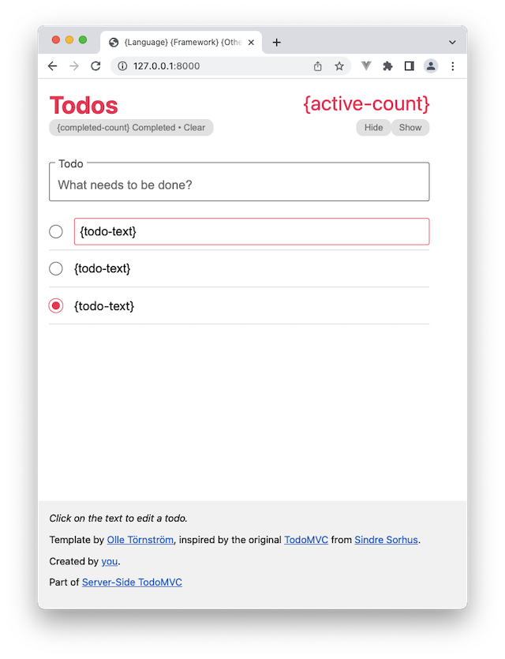

# Example HTML Template

This is the plain HTML-only template-kit that we provide for any example
implementation. It's a custom made asset, but was previously derived from the
[TodoMVC](http://http://todomvc.com) project template.

## Getting started

For any example implementation, it should be a simple matter of copying the
`index.html` page and `style.css` files into the new example implementation.

## Request & Response Compatibility

All the features of the TodoMVC application are normalized for a completely
server-side based implementation to work. This means we have proper HTML forms,
links that go complete GET-requests with parameters, and no Ajax or dynamic
browser features are required in the baseline.
